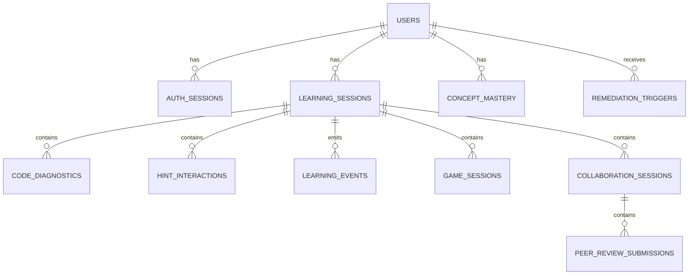

# Code Guru Shared Data Model

This document defines the proposed shared data model for integrating the four Code Guru components:

- Code Coach
- Student Progress Tracker / Study Guider
- Adaptive Gamification Engine
- Collaborative Pair Programming and Peer Review Studio

The current goal is planning only. This document is a design baseline for later implementation.

## Related Docs

- [Integration API Contract](C:/Hello/Tutorials/code-coach/docs/code_guru_integration_api_contract.md)
- [Phase 1 Implementation Plan](C:/Hello/Tutorials/code-coach/docs/code_guru_phase1_implementation_plan.md)
- [Code Coach Proposal Traceability](C:/Hello/Tutorials/code-coach/docs/proposal_traceability.md)

## Design Goals

The shared data model must:

1. Link all meaningful events to the correct logged-in student.
2. Support session-based analysis instead of isolated one-off requests.
3. Allow Code Coach to act as the main diagnostic signal source.
4. Allow downstream components to reuse Code Coach signals without tight coupling.
5. Preserve privacy by minimizing raw code storage.
6. Keep the first implementation simple enough for an academic prototype.

## Recommended Storage Strategy

Use a layered storage approach:

- **MongoDB Atlas** as the primary shared application database.
- **Neo4j** later, only if Study Guider needs a real skill graph implementation.

Why MongoDB first:

- flexible document structure fits heterogeneous data from all four components
- event payloads, diagnostics, review data, and game records are naturally JSON-like
- easy to evolve during the prototype stage without repeated schema migrations
- works well for component event storage and session-centric records
- suitable for a microservice-style architecture where components may emit slightly different payload shapes

Neo4j should be optional and introduced only for:

- skill knowledge graph
- concept prerequisite relationships
- mastery-path reasoning

For the current integration stage, MongoDB Atlas should be treated as the main system of record.

## MongoDB Naming Convention

Use:

- one shared database: `code-guru`
- plural collection names
- `ObjectId` for internal `_id`
- explicit application-level ids such as `userId`, `learningSessionId`, and `diagnosticId` where cross-component references must stay stable

Recommended convention:

```text
_id                 -> MongoDB internal document id
userId              -> stable application user id
learningSessionId   -> stable application session id
diagnosticId        -> stable Code Coach diagnostic id
```

## Data Ownership Principle

Each component owns its own operational records, but all components share:

- identity
- sessions
- learning events
- concept mastery summaries

Recommended ownership:

| Domain | Owner |
|---|---|
| users, auth sessions | shared platform layer |
| coding sessions | shared platform layer |
| code diagnostics, hint interactions | Code Coach |
| struggle signals, remediation triggers, quiz outcomes | Student Progress Tracker / Study Guider |
| game sessions, adaptation decisions | Adaptive Gamification Engine |
| pair sessions, review submissions, collaboration prompts | Collaborative Studio |
| concept mastery summary | shared platform layer, updated by approved components |

## High-Level Entity View



## Document Modeling Rules

Because MongoDB is document-oriented, the first implementation should prefer:

- **references** for large, growing, or reusable records
- **embedding** for small snapshots that are always read together

Recommended rule of thumb:

- embed lightweight summary snapshots
- reference large event histories
- do not embed unbounded arrays that will grow forever

Examples:

- embed a small `latestDiagnosticSummary` inside a session document if needed
- store full diagnostics in the `codeDiagnostics` collection
- store full cross-component events in the `learningEvents` collection

## Core Collections

### 1. `users`

Represents each student, instructor, or admin.

Suggested fields:

| Field | Type | Notes |
|---|---|---|
| `id` | UUID | primary key |
| `studentNumber` | varchar | nullable for non-students |
| `fullName` | varchar | |
| `email` | varchar | unique |
| `role` | varchar | `student`, `lecturer`, `admin` |
| `createdAt` | timestamptz | |
| `status` | varchar | `active`, `disabled` |

### 2. `authSessions`

Tracks login sessions and device/application context.

| Field | Type | Notes |
|---|---|---|
| `id` | UUID | primary key |
| `userId` | UUID | application reference to the user |
| `clientType` | varchar | `vscode`, `web`, `game_ui` |
| `issuedAt` | timestamptz | |
| `expires_at` | timestamptz | |
| `last_seen_at` | timestamptz | |

### 3. `learningSessions`

A single learning attempt context. This is the most important shared entity.

Examples:

- working on a Java arrays lab in VS Code
- doing a Bug Hunt game
- joining a pair programming session

| Field | Type | Notes |
|---|---|---|
| `id` | UUID | primary key |
| `userId` | UUID | application reference to the user |
| `authSessionId` | UUID | application reference to `authSessions` |
| `sourceComponent` | varchar | `code_coach`, `gamification`, `collab`, `study_guider` |
| `taskId` | varchar | assignment or exercise identifier |
| `courseId` | varchar | optional |
| `language` | varchar | `java` initially |
| `startedAt` | timestamptz | |
| `ended_at` | timestamptz | nullable |
| `status` | varchar | `active`, `completed`, `abandoned` |

### 4. `codeDiagnostics`

Main Code Coach persistence collection.

This collection stores the structured output from Code Coach for the logged-in user.

| Field | Type | Notes |
|---|---|---|
| `id` | UUID | primary key |
| `userId` | UUID | application reference to the user |
| `learningSessionId` | UUID | application reference to the session |
| `diagnosticId` | varchar | stable Code Coach diagnostic id |
| `errorType` | varchar | current 3 categories |
| `conceptTag` | varchar | e.g. `array_indexing` |
| `explanationKey` | varchar | maps to hint/lesson logic |
| `line` | integer | nullable if not localizable |
| `column` | integer | nullable if not localizable |
| `confidence` | numeric | final confidence |
| `mlProbability` | numeric | ML classifier probability |
| `locatorConfidence` | numeric | AST location confidence |
| `detectionEngine` | varchar | currently `ml_gated_ast_locator` |
| `status` | varchar | `active`, `resolved`, `repeated`, `ignored` |
| `codeContextHash` | varchar | preferred default instead of raw code |
| `createdAt` | timestamptz | |
| `resolvedAt` | timestamptz | nullable |

Suggested embedded snapshot inside each diagnostic document:

```json
{
  "latestHintState": {
    "lastLevelShown": "guidance",
    "lastShownAt": "2026-04-16T10:30:00Z"
  }
}
```

### 5. `hintInteractions`

Tracks how hints were delivered and used.

| Field | Type | Notes |
|---|---|---|
| `id` | UUID | primary key |
| `userId` | UUID | application reference |
| `learningSessionId` | UUID | application reference |
| `diagnosticRecordId` | UUID | application reference to the stored diagnostic document |
| `hintLevel` | varchar | `concept`, `guidance`, `targeted` |
| `hintKey` | varchar | optional template key |
| `shownAt` | timestamptz | |
| `interactionType` | varchar | `shown`, `expanded`, `next_hint`, `previous_hint` |

### 6. `learningEvents`

General cross-component event stream collection.

This is the most important integration collection because it lets all components publish structured events without directly writing into each other's specialized collections.

| Field | Type | Notes |
|---|---|---|
| `id` | UUID | primary key |
| `userId` | UUID | application reference |
| `learningSessionId` | UUID | application reference |
| `component` | varchar | emitting component |
| `eventType` | varchar | standardized event name |
| `conceptTag` | varchar | nullable |
| `payload` | object | component-specific details |
| `createdAt` | timestamptz | |

Recommended initial event types:

- `code_diagnostic_detected`
- `hint_shown`
- `diagnostic_resolved`
- `diagnostic_repeated`
- `struggle_signal_created`
- `game_session_completed`
- `game_adaptation_decision_created`
- `pair_session_started`
- `peer_review_submitted`
- `micro_lesson_triggered`
- `quiz_completed`
- `mastery_updated`

### 7. `conceptMastery`

Stores the latest summary per user per concept.

| Field | Type | Notes |
|---|---|---|
| `id` | UUID | primary key |
| `userId` | UUID | application reference |
| `conceptTag` | varchar | e.g. `loop_boundaries` |
| `masteryScore` | numeric | 0-1 or 0-100 |
| `struggleScore` | numeric | summary signal |
| `lastEventAt` | timestamptz | |
| `lastUpdatedAt` | timestamptz | |

This should be a summary collection, not the raw source of truth. It can be recalculated from events if needed.

### 8. `remediationTriggers`

Used mainly by Student Progress Tracker / Study Guider.

| Field | Type | Notes |
|---|---|---|
| `id` | UUID | primary key |
| `userId` | UUID | application reference |
| `learningSessionId` | UUID | application reference |
| `triggerSource` | varchar | `code_coach`, `gamification`, `collab`, `multi_source` |
| `conceptTag` | varchar | |
| `reason` | varchar | e.g. `three_consecutive_failures` |
| `struggleLevel` | varchar | `low`, `medium`, `high` |
| `status` | varchar | `open`, `acknowledged`, `completed` |
| `createdAt` | timestamptz | |

### 9. `gameSessions`

Owned by the Adaptive Gamification Engine, but linked to shared users and sessions.

| Field | Type | Notes |
|---|---|---|
| `id` | UUID | primary key |
| `userId` | UUID | application reference |
| `learningSessionId` | UUID | application reference |
| `gameType` | varchar | `drag_drop`, `bug_hunt`, `code_trace` |
| `difficultyLevel` | varchar | |
| `score` | numeric | |
| `errorCount` | integer | |
| `attemptCount` | integer | |
| `hintUsage` | integer | |
| `timeTakenSeconds` | numeric | |
| `traceAccuracy` | numeric | nullable |
| `createdAt` | timestamptz | |

### 10. `collaborationSessions`

Owned by Collaborative Studio.

| Field | Type | Notes |
|---|---|---|
| `id` | UUID | primary key |
| `driverUserId` | UUID | application reference |
| `navigatorUserId` | UUID | application reference |
| `learningSessionId` | UUID | application reference |
| `taskId` | varchar | |
| `startedAt` | timestamptz | |
| `endedAt` | timestamptz | |
| `participationBalanceScore` | numeric | summary |
| `communicationQualityScore` | numeric | summary |

### 11. `peerReviewSubmissions`

Owned by Collaborative Studio.

| Field | Type | Notes |
|---|---|---|
| `id` | UUID | primary key |
| `collaborationSessionId` | UUID | application reference |
| `reviewerUserId` | UUID | application reference |
| `revieweeUserId` | UUID | application reference |
| `linkedDiagnosticId` | varchar | optional link to Code Coach diagnostic |
| `rubricScore` | numeric | |
| `feedbackQualityScore` | numeric | |
| `submittedAt` | timestamptz | |

## Minimum Integration Data Code Coach Must Save

For the first integrated version, Code Coach should persist at least:

- `userId`
- `learningSessionId`
- `diagnosticId`
- `errorType`
- `conceptTag`
- `explanationKey`
- `confidence`
- `mlProbability`
- `locatorConfidence`
- `line`
- `column`
- `status`
- `createdAt`
- `resolvedAt`

This is enough to power:

- repetition counts
- concept struggle tracking
- remediation triggers
- dashboards
- game recommendations
- collaboration-linked review context

## Key Relationships For Cross-Component Use

### Code Coach -> Study Guider

Study Guider should consume:

- repeated diagnostics for the same concept
- unresolved diagnostics
- hint usage intensity
- time-to-fix

Example derived signal:

```text
same concept repeated 3 times
-> create remediation trigger
-> launch micro-lesson
```

### Code Coach -> Adaptive Gamification Engine

Adaptive Gamification should consume:

- dominant weak concept
- recent error frequency
- recent hint dependency

Example:

```text
loop_boundaries weak
-> assign Bug Hunt or Code Trace activity about loops
```

### Code Coach -> Collaborative Studio

Collaborative Studio should consume:

- pair-session diagnostics
- diagnostic-linked review targets
- concept-linked prompts during collaboration

Example:

```text
pair repeatedly hits ARRAY_LENGTH_INDEX_MISUSE
-> show collaboration prompt about last valid array index reasoning
```

## Privacy and Ethics Rules

Recommended defaults:

1. Do not store full raw source code unless evaluation consent exists.
2. Store `codeContextHash` by default.
3. Separate user identity from exported research datasets.
4. Use session-scoped identifiers in research reporting.
5. Keep analysis local or institution-controlled.
6. Add role-based access so lecturers and researchers see only what they are allowed to see.

## Recommended Indexes

Useful early MongoDB indexes:

- `codeDiagnostics: { userId: 1, createdAt: -1 }`
- `codeDiagnostics: { userId: 1, conceptTag: 1, createdAt: -1 }`
- `codeDiagnostics: { learningSessionId: 1, createdAt: -1 }`
- `learningEvents: { userId: 1, createdAt: -1 }`
- `learningEvents: { component: 1, eventType: 1, createdAt: -1 }`
- `conceptMastery: { userId: 1, conceptTag: 1 }`
- `learningSessions: { userId: 1, status: 1, startedAt: -1 }`

## Phased Adoption Plan

### Phase 1

- create shared user and session model
- save Code Coach diagnostics per user/session
- save hint interactions

### Phase 2

- introduce shared `learningEvents`
- let gamification and collaboration write normalized events

### Phase 3

- add remediation triggers
- add concept mastery summary
- connect Study Guider

### Phase 4

- add Neo4j only if skill graph logic truly requires it

## Open Design Decisions

These should be agreed as a team before implementation:

1. Will authentication be centralized or component-local with token federation?
2. What is the exact definition of a `learningSession` across IDE, games, and collaboration?
3. Should raw code ever be stored, and under what consent rules?
4. Will `conceptMastery` be updated synchronously or via a background job?
5. Which component owns the final remediation trigger decision when multiple components emit struggle signals?
