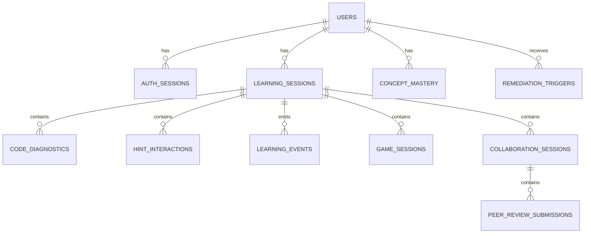

# Code Guru Shared Data Model

This document defines the proposed shared data model for integrating the four Code Guru components:

- Code Coach
- Student Progress Tracker / Study Guider
- Adaptive Gamification Engine
- Collaborative Pair Programming and Peer Review Studio

The current goal is planning only. This document is a design baseline for later implementation.

## Related Docs

- [Integration API Contract](C:/Hello/Tutorials/code-coach/docs/code_guru_integration_api_contract.md)
- [Code Coach Proposal Traceability](C:/Hello/Tutorials/code-coach/docs/proposal_traceability.md)

## Design Goals

The shared data model must:

1. Link all meaningful events to the correct logged-in student.
2. Support session-based analysis instead of isolated one-off requests.
3. Allow Code Coach to act as the main diagnostic signal source.
4. Allow downstream components to reuse Code Coach signals without tight coupling.
5. Preserve privacy by minimizing raw code storage.
6. Keep the first implementation simple enough for an academic prototype.

## Recommended Storage Strategy

Use a layered storage approach:

- **PostgreSQL** as the primary shared application database.
- **Neo4j** later, only if Study Guider needs a real skill graph implementation.

Why PostgreSQL first:

- structured relations fit users, sessions, diagnostics, reviews, and game results
- easy to query for dashboards and evaluation
- good for referential integrity
- easier to defend academically as the main system of record

Neo4j should be optional and introduced only for:

- skill knowledge graph
- concept prerequisite relationships
- mastery-path reasoning

## Data Ownership Principle

Each component owns its own operational records, but all components share:

- identity
- sessions
- learning events
- concept mastery summaries

Recommended ownership:

| Domain | Owner |
|---|---|
| users, auth sessions | shared platform layer |
| coding sessions | shared platform layer |
| code diagnostics, hint interactions | Code Coach |
| struggle signals, remediation triggers, quiz outcomes | Student Progress Tracker / Study Guider |
| game sessions, adaptation decisions | Adaptive Gamification Engine |
| pair sessions, review submissions, collaboration prompts | Collaborative Studio |
| concept mastery summary | shared platform layer, updated by approved components |

## High-Level Entity View



## Core Entities

### 1. `users`

Represents each student, instructor, or admin.

Suggested fields:

| Field | Type | Notes |
|---|---|---|
| `id` | UUID | primary key |
| `student_number` | varchar | nullable for non-students |
| `full_name` | varchar | |
| `email` | varchar | unique |
| `role` | varchar | `student`, `lecturer`, `admin` |
| `created_at` | timestamptz | |
| `status` | varchar | `active`, `disabled` |

### 2. `auth_sessions`

Tracks login sessions and device/application context.

| Field | Type | Notes |
|---|---|---|
| `id` | UUID | primary key |
| `user_id` | UUID | FK to `users.id` |
| `client_type` | varchar | `vscode`, `web`, `game_ui` |
| `issued_at` | timestamptz | |
| `expires_at` | timestamptz | |
| `last_seen_at` | timestamptz | |

### 3. `learning_sessions`

A single learning attempt context. This is the most important shared entity.

Examples:

- working on a Java arrays lab in VS Code
- doing a Bug Hunt game
- joining a pair programming session

| Field | Type | Notes |
|---|---|---|
| `id` | UUID | primary key |
| `user_id` | UUID | FK to `users.id` |
| `auth_session_id` | UUID | FK to `auth_sessions.id` |
| `source_component` | varchar | `code_coach`, `gamification`, `collab`, `study_guider` |
| `task_id` | varchar | assignment or exercise identifier |
| `course_id` | varchar | optional |
| `language` | varchar | `java` initially |
| `started_at` | timestamptz | |
| `ended_at` | timestamptz | nullable |
| `status` | varchar | `active`, `completed`, `abandoned` |

### 4. `code_diagnostics`

Main Code Coach persistence table.

This table stores the structured output from Code Coach for the logged-in user.

| Field | Type | Notes |
|---|---|---|
| `id` | UUID | primary key |
| `user_id` | UUID | FK to `users.id` |
| `learning_session_id` | UUID | FK to `learning_sessions.id` |
| `diagnostic_id` | varchar | stable Code Coach diagnostic id |
| `error_type` | varchar | current 3 categories |
| `concept_tag` | varchar | e.g. `array_indexing` |
| `explanation_key` | varchar | maps to hint/lesson logic |
| `line` | integer | nullable if not localizable |
| `column` | integer | nullable if not localizable |
| `confidence` | numeric | final confidence |
| `ml_probability` | numeric | ML classifier probability |
| `locator_confidence` | numeric | AST location confidence |
| `detection_engine` | varchar | currently `ml_gated_ast_locator` |
| `status` | varchar | `active`, `resolved`, `repeated`, `ignored` |
| `code_context_hash` | varchar | preferred default instead of raw code |
| `created_at` | timestamptz | |
| `resolved_at` | timestamptz | nullable |

### 5. `hint_interactions`

Tracks how hints were delivered and used.

| Field | Type | Notes |
|---|---|---|
| `id` | UUID | primary key |
| `user_id` | UUID | FK |
| `learning_session_id` | UUID | FK |
| `diagnostic_record_id` | UUID | FK to `code_diagnostics.id` |
| `hint_level` | varchar | `concept`, `guidance`, `targeted` |
| `hint_key` | varchar | optional template key |
| `shown_at` | timestamptz | |
| `interaction_type` | varchar | `shown`, `expanded`, `next_hint`, `previous_hint` |

### 6. `learning_events`

General cross-component event stream table.

This is the most important integration table because it lets all components publish structured events without directly writing into each other's specialized tables.

| Field | Type | Notes |
|---|---|---|
| `id` | UUID | primary key |
| `user_id` | UUID | FK |
| `learning_session_id` | UUID | FK |
| `component` | varchar | emitting component |
| `event_type` | varchar | standardized event name |
| `concept_tag` | varchar | nullable |
| `payload_json` | jsonb | component-specific details |
| `created_at` | timestamptz | |

Recommended initial event types:

- `code_diagnostic_detected`
- `hint_shown`
- `diagnostic_resolved`
- `diagnostic_repeated`
- `struggle_signal_created`
- `game_session_completed`
- `game_adaptation_decision_created`
- `pair_session_started`
- `peer_review_submitted`
- `micro_lesson_triggered`
- `quiz_completed`
- `mastery_updated`

### 7. `concept_mastery`

Stores the latest summary per user per concept.

| Field | Type | Notes |
|---|---|---|
| `id` | UUID | primary key |
| `user_id` | UUID | FK |
| `concept_tag` | varchar | e.g. `loop_boundaries` |
| `mastery_score` | numeric | 0-1 or 0-100 |
| `struggle_score` | numeric | summary signal |
| `last_event_at` | timestamptz | |
| `last_updated_at` | timestamptz | |

This should be a summary table, not the raw source of truth. It can be recalculated from events if needed.

### 8. `remediation_triggers`

Used mainly by Student Progress Tracker / Study Guider.

| Field | Type | Notes |
|---|---|---|
| `id` | UUID | primary key |
| `user_id` | UUID | FK |
| `learning_session_id` | UUID | FK |
| `trigger_source` | varchar | `code_coach`, `gamification`, `collab`, `multi_source` |
| `concept_tag` | varchar | |
| `reason` | varchar | e.g. `three_consecutive_failures` |
| `struggle_level` | varchar | `low`, `medium`, `high` |
| `status` | varchar | `open`, `acknowledged`, `completed` |
| `created_at` | timestamptz | |

### 9. `game_sessions`

Owned by the Adaptive Gamification Engine, but linked to shared users and sessions.

| Field | Type | Notes |
|---|---|---|
| `id` | UUID | primary key |
| `user_id` | UUID | FK |
| `learning_session_id` | UUID | FK |
| `game_type` | varchar | `drag_drop`, `bug_hunt`, `code_trace` |
| `difficulty_level` | varchar | |
| `score` | numeric | |
| `error_count` | integer | |
| `attempt_count` | integer | |
| `hint_usage` | integer | |
| `time_taken_seconds` | numeric | |
| `trace_accuracy` | numeric | nullable |
| `created_at` | timestamptz | |

### 10. `collaboration_sessions`

Owned by Collaborative Studio.

| Field | Type | Notes |
|---|---|---|
| `id` | UUID | primary key |
| `driver_user_id` | UUID | FK |
| `navigator_user_id` | UUID | FK |
| `learning_session_id` | UUID | FK |
| `task_id` | varchar | |
| `started_at` | timestamptz | |
| `ended_at` | timestamptz | |
| `participation_balance_score` | numeric | summary |
| `communication_quality_score` | numeric | summary |

### 11. `peer_review_submissions`

Owned by Collaborative Studio.

| Field | Type | Notes |
|---|---|---|
| `id` | UUID | primary key |
| `collaboration_session_id` | UUID | FK |
| `reviewer_user_id` | UUID | FK |
| `reviewee_user_id` | UUID | FK |
| `linked_diagnostic_id` | varchar | optional link to Code Coach diagnostic |
| `rubric_score` | numeric | |
| `feedback_quality_score` | numeric | |
| `submitted_at` | timestamptz | |

## Minimum Integration Data Code Coach Must Save

For the first integrated version, Code Coach should persist at least:

- `user_id`
- `learning_session_id`
- `diagnostic_id`
- `error_type`
- `concept_tag`
- `explanation_key`
- `confidence`
- `ml_probability`
- `locator_confidence`
- `line`
- `column`
- `status`
- `created_at`
- `resolved_at`

This is enough to power:

- repetition counts
- concept struggle tracking
- remediation triggers
- dashboards
- game recommendations
- collaboration-linked review context

## Key Relationships For Cross-Component Use

### Code Coach -> Study Guider

Study Guider should consume:

- repeated diagnostics for the same concept
- unresolved diagnostics
- hint usage intensity
- time-to-fix

Example derived signal:

```text
same concept repeated 3 times
-> create remediation trigger
-> launch micro-lesson
```

### Code Coach -> Adaptive Gamification Engine

Adaptive Gamification should consume:

- dominant weak concept
- recent error frequency
- recent hint dependency

Example:

```text
loop_boundaries weak
-> assign Bug Hunt or Code Trace activity about loops
```

### Code Coach -> Collaborative Studio

Collaborative Studio should consume:

- pair-session diagnostics
- diagnostic-linked review targets
- concept-linked prompts during collaboration

Example:

```text
pair repeatedly hits ARRAY_LENGTH_INDEX_MISUSE
-> show collaboration prompt about last valid array index reasoning
```

## Privacy and Ethics Rules

Recommended defaults:

1. Do not store full raw source code unless evaluation consent exists.
2. Store `code_context_hash` by default.
3. Separate user identity from exported research datasets.
4. Use session-scoped identifiers in research reporting.
5. Keep analysis local or institution-controlled.
6. Add role-based access so lecturers and researchers see only what they are allowed to see.

## Recommended Indexes

Useful early indexes:

- `code_diagnostics(user_id, created_at desc)`
- `code_diagnostics(user_id, concept_tag, created_at desc)`
- `code_diagnostics(learning_session_id, created_at desc)`
- `learning_events(user_id, created_at desc)`
- `learning_events(component, event_type, created_at desc)`
- `concept_mastery(user_id, concept_tag)`

## Phased Adoption Plan

### Phase 1

- create shared user and session model
- save Code Coach diagnostics per user/session
- save hint interactions

### Phase 2

- introduce shared `learning_events`
- let gamification and collaboration write normalized events

### Phase 3

- add remediation triggers
- add concept mastery summary
- connect Study Guider

### Phase 4

- add Neo4j only if skill graph logic truly requires it

## Open Design Decisions

These should be agreed as a team before implementation:

1. Will authentication be centralized or component-local with token federation?
2. What is the exact definition of a `learning_session` across IDE, games, and collaboration?
3. Should raw code ever be stored, and under what consent rules?
4. Will `concept_mastery` be updated synchronously or via a background job?
5. Which component owns the final remediation trigger decision when multiple components emit struggle signals?
